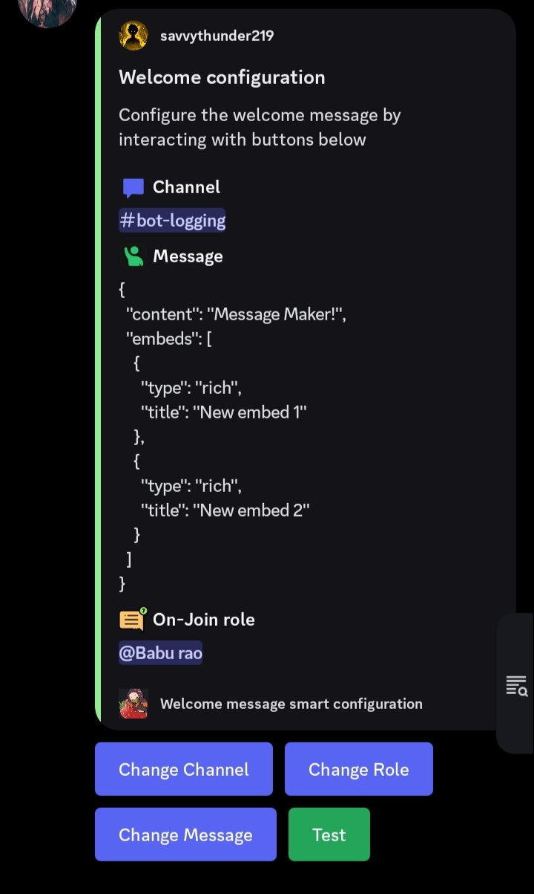

# Advance-welcome-message
A Highly advance welcome command with everything you wishes for. Advance embed builder, button interaction etc. 
# Python Discord Bot

This is a starting point for making your own Discord bot using Python and the [discordpy](https://discordpy.readthedocs.io/) library.
Read [their getting-started guides](https://discordpy.readthedocs.io/en/stable/#getting-started) to get the most out of this template.

## Getting Started

To get set up, you'll need to follow [these bot account setup instructions](https://discordpy.readthedocs.io/en/stable/discord.html),
and then copy the token for your bot and added it as a secret with the key of `TOKEN` in the "Secrets (Environment variables)" panel.

## FAQ

If you get the following error message while trying to start the server: `429 Too Many Requests` (accompanied by a lot of HTML code), 
try the advice given in this Stackoverflow question:
https://stackoverflow.com/questions/66724687/in-discord-py-how-to-solve-the-error-for-toomanyrequests
# Advance-welcome-message
A Highly advance welcome command with everything you wishes for. Advance embed builder, button interaction etc. 

## Overview

This repository contains an Advanced Welcome Command Cog for Discord bots, built using Python. Designed with flexibility and interactivity in mind, this cog enhances the user onboarding experience for your Discord server with customizable features and SQLite3 integration.

## Features

### Interactive Button: 
Welcomes users with buttons to provide them with server information or assign roles.



### Custom Views: 
Easily set up dynamic message layouts using custom views.

### Highly Advanced Message Maker: 
Create personalized and highly customizable welcome messages to suit your server's theme and style.
.jpg)
### SQLite3 Powered: 
Efficiently stores and retrieves data related to new members, roles, and channels.

### Customizable Channel: 
Choose specific channels to send welcome messages.

### Customizable Roles Assignment: 
Automatically assign or allow users to pick roles when they join.


## Installation

1. Clone the repository:

```python
git clone https://github.com/savvythunder/Advance-welcome-message
```


2. Install required dependencies:

```python
pip install -r requirements.txt
```


3. Add the cog to your bot and customize the configuration to fit your server's needs.
   ### Note:
   Don't forget to put the utility and config file in the smae directory as the cog or you'll get error.
   ### How to solve the error?
   edit the code change the file path.
   the cog contains the code which make it able to create the database file and comfig file by it's own. But by any chance it didn't then you should make sure to create it by yourself.


## Usage

Set up your welcome channels, roles, and DM messages using the provided configuration options.

Leverage the advanced message maker to craft personalized welcome messages for new members.

Interact with new users through buttons and assign roles easily.


### Configuration

This cog allows full customization through a simple configuration setup. You can configure:

The channel where welcome messages are sent.

The roles to assign automatically or make available for selection.

The content of the direct message sent to new members.


### Database

This cog uses SQLite3 to store all essential data, such as:

#### Channels

#### Roles

#### Welcome messages

#### User data


## Contribution

### Feel free to submit issues, feature requests, or pull requests to contribute to this project!
